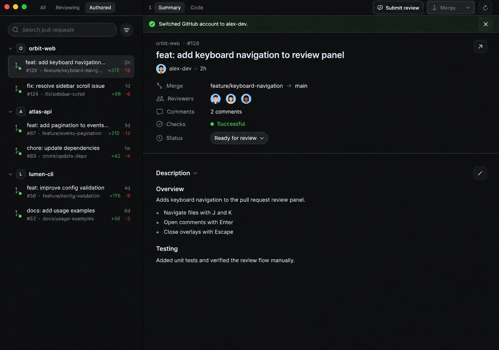
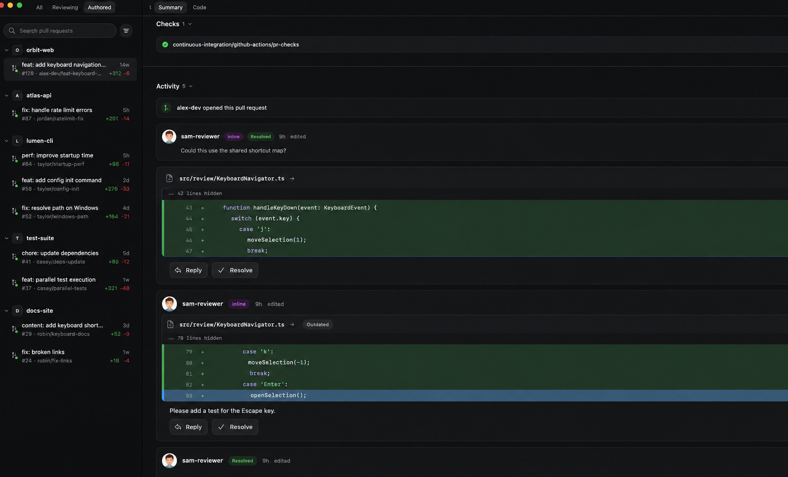
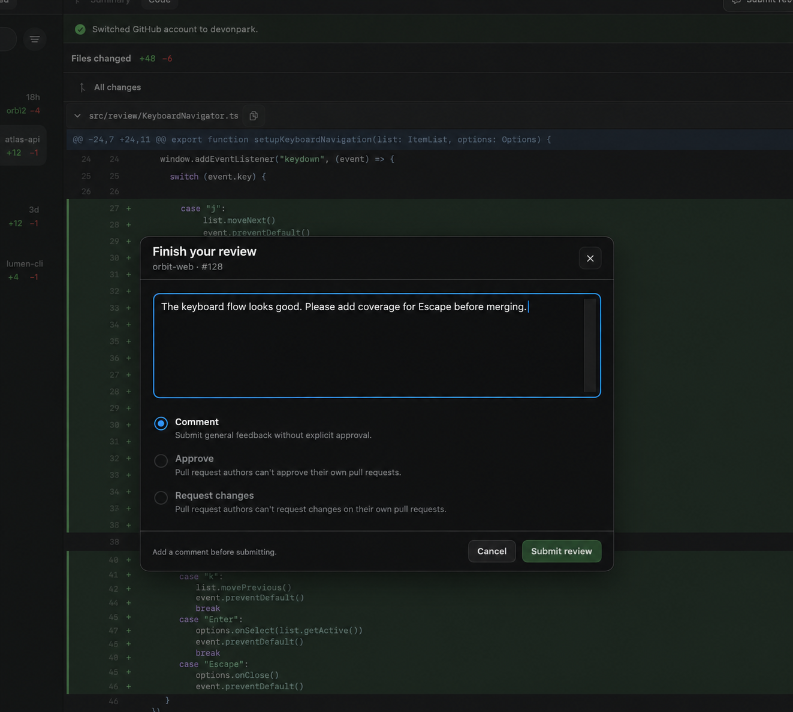
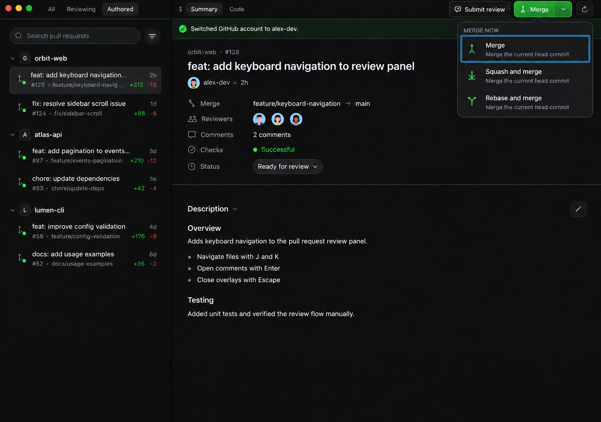
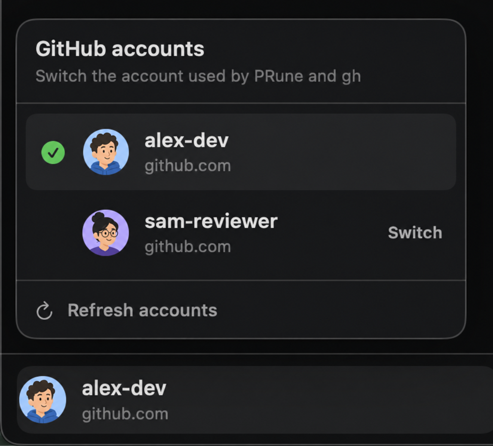

<p align="center">
  
</p>

<h1 align="center">PRune</h1>

<p align="center">
  A native GitHub pull request manager and review client for macOS.
</p>

## Features

- Browses All, Reviewing, and Authored pull requests grouped by repository, with incremental loading, search, pull-request status, and check-status filters
- Switches between GitHub accounts authenticated through the local `gh` CLI
- Shows pull request summaries, reviewers, checks, activity, commits, changed files, and merge blockers
- Opens all changes or a single commit in unified or split, syntax-highlighted diffs
- Collapses individual files or the entire diff, copies file paths, opens the pull request on GitHub, and refreshes on demand
- Edits authored pull request descriptions, changes their status between Draft and Ready for review, and closes or reopens them
- Posts, replies to, quotes, edits, deletes, and locally hides comments
- Resolves and reopens review threads, including code context for outdated comments
- Drafts line-level comments and submits Comment, Approve, or Request changes reviews
- Merges with merge commits, squash, or rebase, and enables or disables auto-merge when GitHub allows it

Every action that writes to GitHub shows a native confirmation dialog first. Authentication and repository permissions come from the local `gh` CLI; the app does not store a GitHub token.

## Screenshots

### Pull request overview

<p align="center">
  
</p>

### Code review

<p align="center">
  
</p>

### Submit a review

<p align="center">
  
</p>

### Merge options

<p align="center">
  
</p>

### Switch GitHub accounts

<p align="center">
  
</p>

## Requirements

- GitHub CLI (`gh`): `brew install gh`
- Xcode, or compatible Xcode Command Line Tools with Swift 6.2 or newer

## Build and run

```sh
swift build &&
  ./scripts/package-app.sh &&
  open "build/PRune.app"
```

Chaining the commands prevents `package-app.sh` from packaging an older binary when the build fails.

### Missing `SwiftUIMacros` plugin

If `swift build` reports that `SwiftUIMacros.StateMacro` could not be found, the selected SDK and Swift toolchain are not a complete matching installation. Prefer selecting a full Xcode installation:

```sh
sudo xcode-select --switch /Applications/Xcode.app/Contents/Developer
sudo xcodebuild -runFirstLaunch
swift build
```

As a temporary workaround, if the macOS 26.5 SDK is installed, build against it explicitly:

```sh
swift build --sdk /Library/Developer/CommandLineTools/SDKs/MacOSX26.5.sdk &&
  ./scripts/package-app.sh &&
  open "build/PRune.app"
```

## License

Copyright 2026 Shiloh Lee. Licensed under the [Apache License 2.0](LICENSE).
